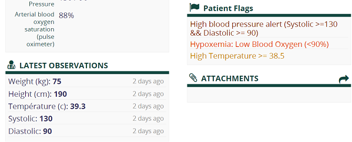

# OpenMRS Provenance Demonstrator

OpenMRS captures patient data through a set of clinical terminology associated with concepts, observations and encounters. However, the OpenMRS system lacks constraints and procedures for defining abnormal health conditions and levels of critical illness. This document focuses on four parts: first, setting up OpenMRS instance for digital provenance; second, explaining concepts and concept dictionary in OpenMRS; third, deploying Patient Flags module; and exemplifying data provenance of the system via Patient Flags modules.

---

### *Table of content*

  1. [Build OpenMRS](#build-openmrs)
     1. [Prerequisites](#prerequisites)
     2. [Installation options and guidelines](#installation-options-and-guidelines)
  2. [Medical concepts in OpenMRS](#-medical-concepts-in-openmrs)
  3. [Patient Flags module for tracing the provenance](#patient-flags-module-for-tracing-the-provenance)
       1. [Deploy module](#deploy-module)
       2. [User guidance](#user-guidance)
  4. [Provenance patients' data in OpenMRS through the Patient Flags module](#-provenance-patients-data-in-openmrs-through-the-patient-flags-module)

 

## **Build OpenMRS**

---

### **Prerequisites**

- Java 8
- [Maven 3.8.4](https://maven.apache.org/download.cgi)
- MySQL 8.0.27

 

### **Installation options and guidelines**

There are two options for deploying OpenMRS instance:

1. Install OpenMRS server on Docker without demo data
1. Install OpenMRS server on Docker with small data set of 30 patients

**Installation Guide:** [README.md](openmrs-docker\README.md) in *openmrs-docker* folder

**Usage Guide:**: [usage-guide.md](openmrs-docker\usage-guide.md) in *openmrs-docker* folder

 

## **Medical concepts in OpenMRS**

---

**Concept Dictionary:** A list of all the medical and program-related terms used in OpenMRS as questions and answers.

**Concept:** The individual data points collected from a population of patients. Concepts include both questions and answers.

**Observations:** A piece of information is recorded about a person at a specific time. Every observation has a Concept as its question, depending on the concept's data type.

**Encounter:** A single, specific interaction between the patient and a provider. An encounter can be any interaction, e.g. doctor visits, notes, orders.

### **Relationship Between Concepts and Observations**

While observation is any clinical measurement acquired and observable in a clinical setting, a concept describes observational data in OpenMRS.
In addition, the concept dictionary is a collection of definitions for any concept collected within the repository that is inherent within the data model. Hence, similar to a dictionary defining the function, meaning, and relationships of the words, the concept dictionary defines the name, code, and appropriate attributes for any observations or data collected (including medical tests, drugs, results, symptoms and conditions).

 

## **Patient Flags module for tracing the provenance**

---
**Patient Flags** module displays **Flags** that generate a warning message on a patient dashboard when certain criteria are met and finds all patients that match a set of criteria.

### [**Deploy module**](patientflags-module/installation-guide.md)

### [**User guidance**](patientflags-module/usage-guide.md)

 

## **Provenance patients' data in OpenMRS through the Patient Flags module**

---

As discussed above, the **Concept Dictionary** is a list of all the medical and program-related terms that you will use as questions and answers in **Observations**; and **observation** is the actual health care information of a patient at a moment in time. OpenMRS allows users to import and customize their prefered medical terminology resources (both standard and non-standard), which will then be used in all patients' health data, e.g. weight, height, blood pressure.
Initial OpenMRS concept resource after setting up the server is a mixed source of clinical concepts from various concept dictionary terms mapped with others (i.e. SNOMED, ICD10, LOINC, etc.) New Zealand hospitals use the classification system [ICD-10-AM/ACHI/ACS](https://www.health.govt.nz/nz-health-statistics/classification-and-terminology/icd-10-am-achi-acs) and [SNOMED CT](https://browser.ihtsdotools.org/?perspective=full&conceptId1=404684003&edition=MAIN/SNOMEDCT-NZ/2021-10-01&release=&languages=en,mi) as standard for clinical terminology.

Although OpenMRS has a standardized concept dictionary for understanding medical terms, there is a lack of official resources for clinicians to refer to when assessing patients' levels of critical care and abnormal health conditions.
For example, for patients who had had their vitals captured by clinicians, their vitals can be abnormal in terms of high blood pressure, BMI in the obesity range, and so on. However, there were no resources shown to the patients answering:

1. The explanations for declaring vitals are in the abnormal range and what are the acceptable values.
2. From which resources say that their health conditions need critical care.
3. Based on what resources and set of rules, OpenMRS and clinicians can define that this patient has a higher critical level and needs higher priority and care.

- In the photo above, with the latest observations, the Patient Flags module flagged three warning flags on this patient's dashboard, saying that some vitals were abnormal.

- By noticing the different colours of those three flags, these flags have different levels of priority ranking, ranging from highest priority to lowest priority.
- However, the rules for those flags are hardcoded in numbers and priority choices.

- The concept_id associated with temperature is 5058. The photo shows that creating a flag for alerting patients with high temperatures has to call the concept_id and hardcoded the temperature value is >= 38.5 °C.
- Furthermore, from various priorities created from Manage Priority, the writer can freely choose the Priority level without any constraints. Message property, shown on the Patient Dashboard, can also be written randomly, even not related to the Flag criteria above.
- Finally, the problem with this module is that once the patient gets flags based on previous observations, the flags will not lose even new observations recorded are not met the flag criteria anymore.

 

In conclusion, although OpenMRS already has a standardized concept dictionary, the system needs computerized algorithms to trace clinical data for a more transparent and truthful medical diagnosis.
