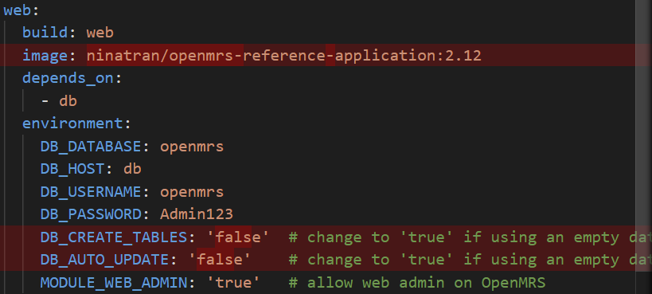
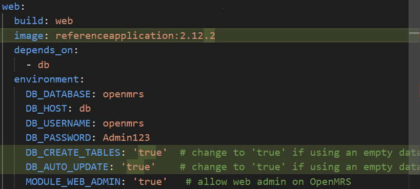

# INSTALLATION GUIDE

## Description

---
Run openmrs distribution referenceapplication and mysql as docker containers with a small demo dataset.

## Requirements

---

- Docker engine
- Docker compose

## Development

---

### To start both containers for installing OpenMRS on Docker

> **Note:** Using the openmrs folder in this directory for both installation options (with or without demo data)

```shell
cd openmrs
```

1. To install with demo data: 30 patients

  ```shell
  docker-compose up
  ```

2. To install without data:
- Delete **dbdump folder** in the openmrs folder

- Under ***web service*** in [docker-compose.yml](openmrs/docker-compose.yml) file in the openmrs folder:
  - Change **image:** from *ninatran/openmrs-reference-application:2.12* into *referenceapplication:2.12.2* (or any new image name prefered)
  - Change **DB_CREATE_TABLES:** and **DB_AUTO_UPDATE:** from *false* into *true*.

      **docker-compose.yml file differences:**

      | Demo Data | No Data |
      | :---: | :---: |
      |  |  |

  - After saving all the changes, run the command:

      ```shell
      docker-compose up
      ```

The initial setup which follows may take some time; just let it run in the background.

At the end of the process, the Web Application Manager will refresh.
When these log messages appear on the screen, the application will be accessible on <http://localhost:8080/openmrs>.

```text
Username: admin
Password: Admin123
```

**Note:** This is Super User account (system administrators), which is automatically granted all privileges in the system.

Details about different user accounts initially built-in OpenMRS will be described in [usage-guide.md](./usage-guide.md)

<details>

  **<summary>Log Messages</summary>**

```prolog
INFO - ServiceContext.doneRefreshingContext(832) |2022-02-04T00:07:25,286| Done refreshing Context
WARN - SpaActivator.createFrontendDirectory(45) |2022-02-04T00:07:25,501| Frontend directory /usr/local/tomcat/.OpenMRS/frontend doesn't exist.  Creating it now.
WARN - IdgenTask.run(32) |2022-02-04T00:07:28,839| Not running scheduled task. DaemonToken = null; enabled = false
INFO - SerializationServiceImpl.getDefaultSerializer(73) |2022-02-04T00:07:30,350| No default serializer specified - using builtin SimpleXStreamSerializer.
Security framework of XStream not explicitly initialized, using predefined black list on your own risk.
Security framework of XStream not explicitly initialized, using predefined black list on your own risk.
INFO - SerializationServiceImpl.getDefaultSerializer(73) |2022-02-04T00:07:31,206| No default serializer specified - using builtin SimpleXStreamSerializer.
Security framework of XStream not explicitly initialized, using predefined black list on your own risk.
ERROR - CommonsLoggingOutput.error(75) |2022-02-04T00:07:35,870| Line=362 The content of element type "dwr" must match "(init?,allow?,signatures?)".
ERROR - CommonsLoggingOutput.error(75) |2022-02-04T00:07:35,877| Parameter mismatch parsing signatures section in dwr.xml on line: DWRAtlasService.disableAtlasModule()
ERROR - CommonsLoggingOutput.error(75) |2022-02-04T00:07:35,881| Parameter mismatch parsing signatures section in dwr.xml on line: DWRHtmlFormEntryService.checkIfLoggedIn()
WARN - OpenmrsUtil.getRuntimePropertiesFilePathName(2032) |2022-02-04T00:07:35,911| Unable to find a runtime properties file at /usr/local/tomcat/openmrs-runtime.properties
WARN - OpenmrsJspServlet.rescanTldsIfNeeded(56) |2022-02-04T00:12:16,950| Rescanning TLDs
```

</details>

<br>

#### **Error Log Message**

While running docker-compose, some error messages may appear. Those are non-fatal errors; the server will still be running fine.

```prolog
web_1  | ERROR - BrokerService.checkSystemUsageLimits(1925) |2022-02-03T22:21:52,218| Temporary Store limit is 51200 mb, whilst the temporary data directory: /usr/local/tomcat/.OpenMRS/activemq-data/localhost/tmp_storage only has 45523 mb of usable space
web_1  | WARN - IdgenTask.run(32) |2022-02-03T22:22:04,816| Not running scheduled task. DaemonToken = null; enabled = false
web_1  | java.lang.IllegalStateException: Filters can not be added to context /openmrs as the context has been initialised
web_1  |  at org.apache.catalina.core.ApplicationContext.addFilter(ApplicationContext.java:1049)
web_1  |  at org.apache.catalina.core.ApplicationContext.addFilter(ApplicationContext.java:1014)
web_1  |  at org.apache.catalina.core.ApplicationContextFacade.addFilter(ApplicationContextFacade.java:454)
```

```prolog
web-1  | ERROR - CommonsLoggingOutput.error(75) |2022-02-04T00:07:35,870| Line=362 The content of element type "dwr" must match "(init?,allow?,signatures?)".
web-1  | ERROR - CommonsLoggingOutput.error(75) |2022-02-04T00:07:35,877| Parameter mismatch parsing signatures section in dwr.xml on line: DWRAtlasService.disableAtlasModule()
web-1  | ERROR - CommonsLoggingOutput.error(75) |2022-02-04T00:07:35,881| Parameter mismatch parsing signatures section in dwr.xml on line: DWRHtmlFormEntryService.checkIfLoggedIn()
web-1  | WARN - OpenmrsUtil.getRuntimePropertiesFilePathName(2032) |2022-02-04T00:07:35,911| Unable to find a runtime properties file at /usr/local/tomcat/openmrs-runtime.properties
web-1  | WARN - OpenmrsJspServlet.rescanTldsIfNeeded(56) |2022-02-04T00:12:16,950| Rescanning TLDs
```

<br>

### To stop all containers

Use _CTRL + C_ to stop all containers.

<br>

### To change distro file

If you made any changes (modified modules/owas/war) to the distro run:

```shell
docker-compose up --build
```

<br>

### To shutdown and delete containers

If you want to destroy containers and delete any left over volumes and data when doing changes to the docker
configuration and images run:

```shell
docker-compose down -v
```

In the development mode the OpenMRS server is run in a debug mode and exposed at port 1044. You can change the port by
setting the DEBUG_PORT environment property or by editing the `.evn` file before starting up containers.

Similarly MySQL is exposed at port 3306 and can be customized by setting the MYSQL_PORT property.

<br>

>**Note:** The Production section below is only the OpenMRS organization's instructions. For our purpose, we run command **docker-compose up**

## Production

---
To start containers in production:

```shell
docker-compose -f docker-compose.yml -f docker-compose.prod.yml up
```

Application will be accessible on <http://localhost/openmrs>.

Note that in contrary to the development mode the OpenMRS server is exposed on port 80 instead of 8080.
No other ports are exposed in the production mode.
