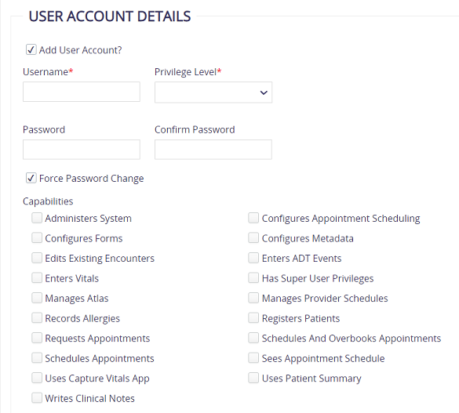
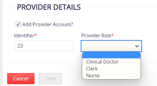
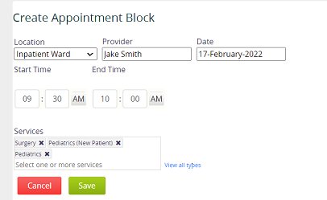
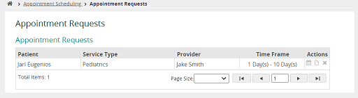
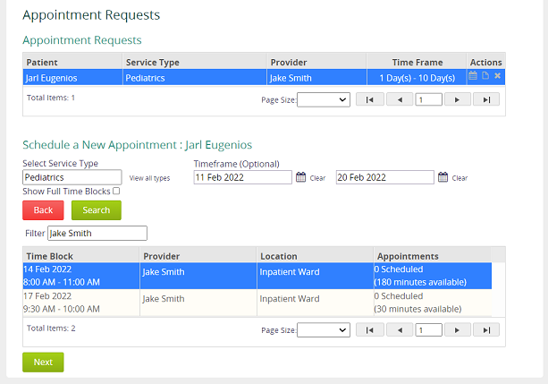
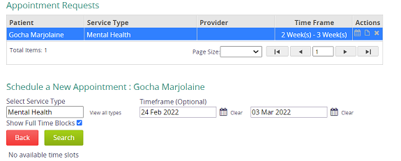

# User Management and Access Control

 

### *Table of Contents*
1. [Users, Roles, and Privileges](#users-roles-and-privileges)
2. [Users in OpenMRS](#users-in-openmrs)
    1. [Designing role and privilege schemes](#designing-role-and-privilege-schemes)
    2. [Use Cases](#use-cases)
        1. [Clerk](#insclerkins)
        2. [Nurse](#insnurseins)
        3. [Doctor](#ins-doctor-ins)
        4. [System Administrator](#ins-system-administrator-ins)
        5. [Scheduler](#ins-scheduler-ins)
 

## **Users, Roles, and Privileges**

---

A **User** in OpenMRS is an account that a person may log into the system. The real-life person must be represented by a Person record in OpenMRS, and a person may have more than one user account.
A **Role** represents a group of privileges in the system. Roles may inherit privileges from other roles, and Users may have one or more Roles.
A **Privilege** is an authorization to perform a particular action in the system (e.g., **Edit Patients** or **Add Users**).
**Note:** You can configure which Roles have which Privileges while configuring your system.**Roles** and **Privileges** are controlled through the **Administration** page, under the **Manage Users** section.

 

## **Users in OpenMRS**

---

**Note:** All these user accounts can be modified with different roles and privileges.

| **user.name** | doctor | nurse | clerk | sysadmin | admin | scheduler |
|:--------------|:---------:|:--------:|:--------:|:-----------:|:---:|:---:|
| **password** | Doctor123 | Nurse123 | Clerk123 | Sysadmin123|Admin123| Scheduler123 |

 

### **Designing role and privilege schemes**

| Users | Roles | Description | Inherited Roles |
| :---: | :--- | :--- | :--- |
| **Clerk** |  Organizational: Registration Clerk | Registration Clerk | Application: Registers Patients   Application: Schedules Appointments   Application: Sees Appointment Schedule |
| **Nurse** | Organizational: Nurse | Nurse | Application: Enters ADT Events   Application: Records Allergies   Application: Requests Appointments   Application: Sees Appointment Schedule    Application: Uses Patient Summary   Application: Uses Capture Vitals App   Application: Enters Vitals |
| **Doctor** | Organizational: Doctor | Doctor | Application: Enters ADT Events   Application: Records Allergies   Application: Requests Appointments   Application: Sees Appointment Schedule    Application: Uses Patient Summary   Application: Writes Clinical Notes |
| **SysAdmin** | Organizational: System Administrator |  System Administrator | Application: Administers System   Application: Configures Appointment Scheduling   Application: Configures Forms   Application: Configures Metadata   Application: Manages Atlas   Application: Manages Provider Schedules |
| **Scheduler** | System Developer | An appointment scheduler organizes patient appointments, schedules procedures, and coordinates office visits according to physician and patient availability | Has all roles and privileges |
| **Admin** | System Developer | Developers of the OpenMRS have additional access to change fundamental structure of the database model | Has all roles and privileges |
| ^^ | Provider [^1] | All users with the 'Provider' role will appear as options in the default Infopath | |

[^1]:In a common deployment scenario, you will have several roles that use the same privileges with only a few differences. It is simpler to manage these privileges by defining a new role from which the others can all inherit. With the **Provider** role, you can then control most of the privileges within the Provider role, and those changes will affect all types of providers in the system.

 

### **Use Cases**

---

#### <ins>**Clerk**</ins>

1. **Register Patient**

    <ins>Main Flow</ins>
      1. Clerk selects **Register a Patient**.
      2. The clerk provides the patient's personal information (Name, Gender, Birthdate, Address, Phone number, Relatives).
      3. The clerk saves registration information.
      4. The system creates a patient dashboard for the newly registered patient.
   [**A1:** Clerk acknowledges the wrong information was registered]
   [**O1:** Add patient's new condition]
      5. The clerk returns to homepage.

    <ins>Alternative flow:</ins> Clerk acknowledges the wrong information was registered (A1)
      1. The clerk selects **Edit Registration Information**.
      1. The clerk chooses the type of information to edit.
      1. The clerk changes the information.
      1. The clerk saves the form.
      1. The system responds with confirmation of the changes.
  
    <ins>Optional flow:</ins> Add patient's new condition
      1. The clerk selects **Add new condition**.
      2. The clerk add the condition information.
      3. The clerk chooses onset date for the condition.
      4. The clerk chooses active status for the condition. [A2: Choose inactive status]
      5. The clerk saves conditions.
      6. The system adds the recorded condition in active condition list.
    <ins>Alternative flow:</ins> Choose inactive status (A2)
        1. The clerk chooses inactive status for the condition.
        2. The clerk chooses end date for the condition.
        3. The clerk The clerk saves conditions..
        4. The system adds the recorded condition in inactive condition list.

4. **Schedule appointment**
    <ins>Main Flow</ins>
      1. Clerk selects **Appointment Scheduling > Manage Appointments**.
      2. The clerk searches for the patient (either by name or patientId).
      3. The clerk selects service type.
      4. The clerk select timeframe. (Optional Flow)
      5. The system searches appointment timetable
   [**E1:** No available time slots]
      6. The clerk chooses the slot for appointment.  
      7. The clerk confirms patient's appointment.
      8. The systems responds with confirmation of the appointment for chosen patient.

    <ins>Exeption flow:</ins> No available time slots (E1)
      1. Cancel appointment scheduling.

---
  
#### <ins>**Nurse**</ins>

1. Capture Vitals
    <ins>Main Flow</ins>
      1. Nurse searches for the patient in capture vitals app (either by name or patientId). [A1: Find active patients in active list]
      2. The nurse chooses a patient to record vitals. [A2: The patient has not been checked-in]
      3. The nurse capture patient's vitals.
      4. The nurse confirms patient's vitals.
      5. The system responds with confirmation of vitals entered.

    <ins>Alternative flows:</ins>
    *A1: Find active patients in active list*
      1. Nurse selects **Active Visits**
      2. Nurse searches for the patient
    The use case continues at step 3 in Main Flow.

    *A2: The patient has not been checked-in*

      - Precondition: Nurse searches for the patient in capture vitals app (either by name or patientId) (use step 1 in Main Flow)
      - Description: The patient must be checked-in before their vitals can be recorded. Send the patient to the check-in counter.

       

      1. Nurse clicks to return to homepage.
      2. Nurse chooses **Find Patient Record**.
      3. Nurse searches for the patient (either by name or patientId).
      4. Nurse selects **Start Visit**.
The use case continues at step 3 in Main Flow.

 

2. View patient's appointment/appointment request
    <ins>Main Flow</ins>
      1. Nurse selects **Appointment Scheduling > Manage Appointments**.
      2. Nurse searches for the patient (either by name or patientId).
      3. Nurse can view the chosen patient's appointment schedules.

    <ins>Alternate flow</ins>
      1. Nurse selects **Find Patient Record**.
      1. Nurse searches for the patient (either by name or patientId).
      1. Nurse can view the chosen patient's appointment schedules from the patient dashboard.

    **Note:** Doctor can also view patient's appointment/appointment request using the same workflow

---

#### <ins> **Doctor** </ins>

1. Take clinical notes
    <ins>Main Flow</ins>
      1. Doctor selects **Active Visits** [A1: The patient has not been checked-in]
      2. Doctor searches for the patient
      3. Doctor takes visit notes for the chosen patient.
      4. Doctor adds presumed or confirmed diagnosis.
      5. Doctor selects whether the chosen diagnosis is primary/confirmed.
      6. Doctor may write clinical note.
      7. Doctor saves the visit notes.
      8. The system responds with confirmation of visit notes entered.
      9. The system adds the visit note and a list of diagnoses on the Patient Dashboard.

    <ins>Alternative flow:</ins>
      1. Doctor chooses **Find Patient Record**.
      2. Doctor searches for the patient (either by name or patientId).
      3. Doctor selects **Start Visit**.
The use case continues at step 3 in Main Flow.

 

2. Admit/transfer/discharge patient to Inpatient
    <ins>Main Flow</ins>
      1. Doctor selects **Active Visits** [A1: The patient has not been checked-in]
      2. Doctor searches for the patient
      3. On the chosen patient's dashboard, doctor admits/tranfers/discharges the patient. [A2: Cannot transfer/discharge patient]
      4. Doctor may change **Admission Date** or **Admitted By** (the person performs this task)
      5. Doctor saves the visit notes.
      6. The system responds with confirmation of admission entered.
      7. The system adds the admission and location on the Patient Dashboard.

    <ins>Alternative flows:</ins>
    *A1: The patient has not been checked-in*
      1. Doctor chooses **Find Patient Record**.
      2. Doctor searches for the patient (either by name or patientId).
      3. Doctor selects **Start Visit**.
The use case continues at step 3 in Main Flow.

     

    *A2: Cannot transfer/discharge patient*

    - Precondition to transfer/discharge patient: The patient must be admitted to Inpatient before being transferred/discharged.

     

    1. Admit patient following Main Flow from step 1.
    2. Then, transfer/discharge patient following Main Flow from step 1 again.

**Note:** Nurse also can perform this task.

---

#### <ins> **System Administrator** </ins>

1. Add/Edit service type

    **Service Type:** A service provided by healthcare centres, e.g. General Medicine, Dermatology.

    <ins>Main Flow</ins>
      1. Administrator selects **Appointment Scheduling > Manage Service Types**.
      2. Administrator chooses to add new service type or edit existing service type.
      3. Administrator change the name for service.
      4. Administrator add duration to perform this service (in minutes)
      5. Administrator may add description for the service.
      6. Administrator saves the service types.
      7. The system responds with confirmation of service type saved.
      8. The system adds the new service type in the list.

 

2. Add User Accounts
    <ins>Main Flow</ins>
      1. Administrator selects **System Administration > Manage Accounts > Add New Account**.
      2. Administrator provides person's information (Lastname, firstname, gender).

      3. Administrator selects Add User Account.
      4. Administrator adds username, privilege level (high/full), password.
      5. Administrator may add Capabilities for new user account.

      6. Administrator may Add Provider Account for the new account (The new User will have roles associated with the Provider Account).

      7. The system responds with confirmation of new user saved.
      8. The system adds the new user account in the list.

 

---

#### <ins> **Scheduler** </ins>

  **Note:** In real life, an appointment scheduler organizes patient appointments, schedules procedures, and coordinates office visits according to physician and patient availability. Hence, the scheduler account in OpenMRS should not have a System Developer role. However, Super User (a Person in OpenMRS) has both Admin and Scheduler accounts, so that scheduler also has a System Developer role (which can be modified).
  Those two use cases below show the real-life use cases of the scheduler in healthcare.

1. Create appointment blocks
    <ins>Main Flow</ins>
      1. Scheduler selects **Appointment Scheduling > Manage Provider Schedules**.

      2. Scheduler chooses the date for creating new appointment block.
      3. Scheduler may choose location, provider and start/end time of the appointment block.
      4. Scheduler selects service(s) performed.
      5. Scheduler saves the appointment block.

      6. The system adds the new appointment block to the calendar.

 

1. Manage Appointment Requests

    <ins>Main Flow</ins>
      1. Scheduler selects **Appointment Scheduling > Appointment Requests**.

      2. Scheduler clicks the calendar symbol in the Action section to view the time block available for the appointment.
      3. Scheduler chooses the time block prefered to schedule a new appointment. [A1: No time slot available]
      4. Scheduler clicks **Next** to confirm the appointment.

      5. Scheduler saves the appointment.
      6. The system removes the appointment request from the list.

    <ins>Alternative flow:</ins> No time slot available (A1)
        1. Scheduler needs to return to the homepage.
        2. Scheduler adds a new appointment block to accommodate the appointment request. (Follows *Create appointment blocks* use case)
     The use case continues from the start of Main Flow.

