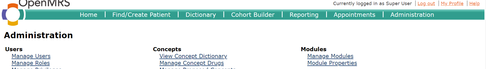
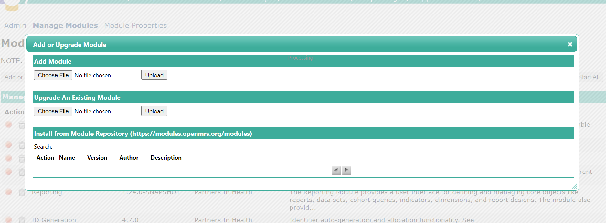
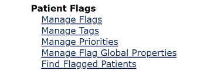

# Installation Guideline for Patient Flags module

## Prerequisites

1. Have created an OpenMRS server.
2. [Apache Maven 3.8.4](https://maven.apache.org/download.cgi)
3. IntelliJ IDE

## Build Patient Flags module

- Open folder **openmrs-module-patientflags** in IntelliJ IDE
- In IntelliJ, execute maven goal with this command

```shell
mvn clean install -DskipTests=true -Dmaven.javadoc.skip=true --batch-mode --show-version --file pom.xml
```

- This will create a **patientflags-3.0.3-SNAPSHOT.omod** file in **.\omod\target**

## Deploy Patient Flags module

1. Start OpenMRS server.
2. Log in to your server as administrator.
   - Username: Admin
   - Password: Admin123
3. On the new UI, select **System Administration > Advanced Administration > Manage Modules > Add or Upgrade Module**.

4. Under **Add Module**, browse to **patientflags-3.0.3-SNAPSHOT.omod** and select the **Upload Module** button.


**Note:** Uploading module will take some time to generate resources and change database. When the upload process is complete you will see a window displays module details:

> Module has been loaded and started successfully.



However, Tomcat needs to initialize the changes, and there will be errors when trying to access the Patient Flags section below.
***Restart OpenMRS server after the above message appear***
