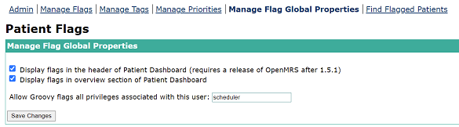

# Patient Flags User Guide

---

## Features

### Manage Priorities 

- View table of existing priorities: their name, indicator and rank.
- Add New priorities - Select a name, numeric rank value and associated color indicator from a color swatch.
- Modify existing priorities.
- Delete priorities

**Note:**

- Rank: The smaller ranking value indicates higher levels of priority (1 is the highest priority).
- Style: Must include _style="..."_ in the style property.

---

### Manage Tags

- View table of existing tags.
- Add New tags: 
  - Select a tag name 
  - Which user group(s) the tag is visible to and Display points (patient dashboard or patient header).
- Modify existing tags.
- Delete tags.

#### **Edit Tag**

**Note:**
- Tag: The tag name 
- Visible To: Allow choosing multiple user groups
- Show In: referring to Display points, which is empty in the database. Because in Manage Flag Global Properties, the default setup is on both Patient Overview and Patient Header.

---

### Manage Flags

- View table of existing flags.
- Add New flags: Select a flag name, an associated group of tags and a priority for the flag. Select whether flag is enabled or disabled.
- Modify existing flags.
- Delete flags.
- Filter flags by tags.

**Note:**

- Type: Groovy Flag, SQL Flag and custom Flag
- Detail instruction for creating a flag: <https://wiki.openmrs.org/display/docs/Patient+Flags+Module>
- [SQL statement examples](patientflags-module/patientflags_sql_examples.txt)

---

### Search

- Find patients associated with a particular flag.
- Display Patient particulars, associated tags and flag enabled status.

