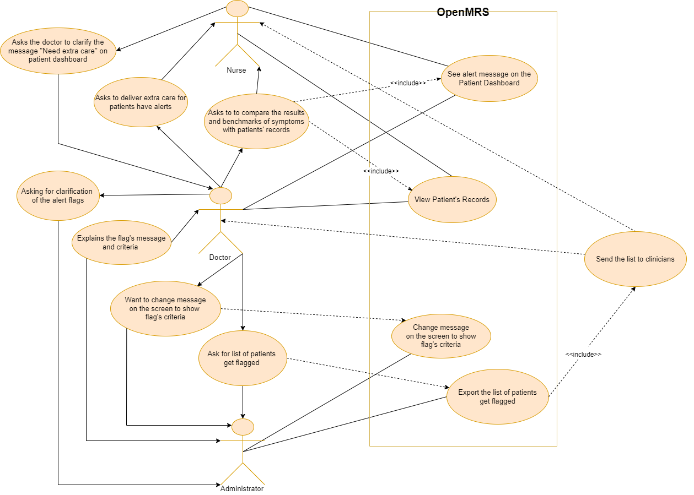

# Provenance inspection use case

Introduce the tracing provenance of data in OpenMRS through a scenario where three actors (doctor, nurse and administrator) take certain steps to inspect the alert flag appearing on Patient Dashboard. This use case will happen after the use case in the [provenance scenario](provenance-scenario.md).

---

After acknowledging the alert flags on the Patient Dashboard, the nurse reports to the doctor about the patient. She asks the doctor to clarify the message "Need extra care" appeared.

The doctor then asks the system administrator about the alert appearing on the Patient Dashboard.

The system administrator explains the message and conditions when determining the flag.

The doctor wants the system administrator to change the message on the screen to indicate criteria when determining the flag.

The doctor wants the system administrator to send the list of patients who get flagged.

The doctor sends the nurse the list to compare the results and benchmarks of symptoms with the patients' most recent vitals.

The doctor tells the nurse to deliver extra care for those patients.
