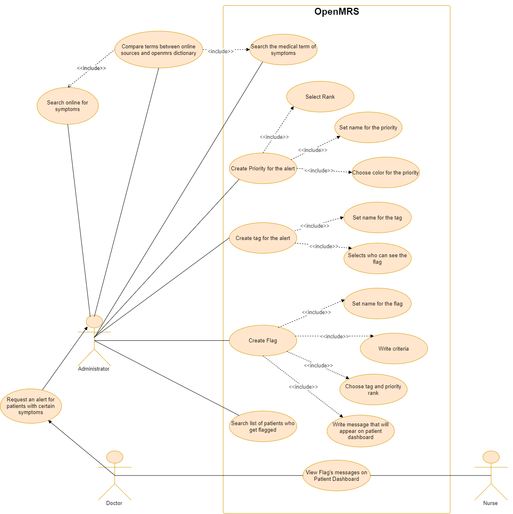
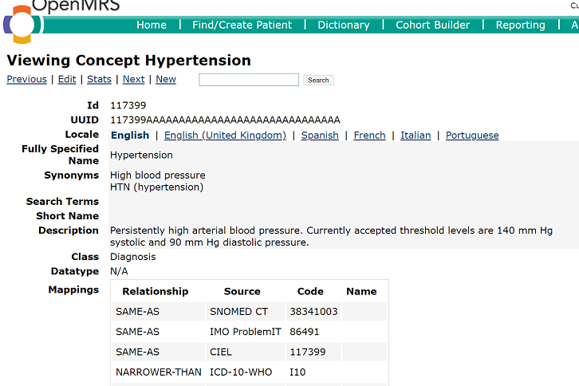
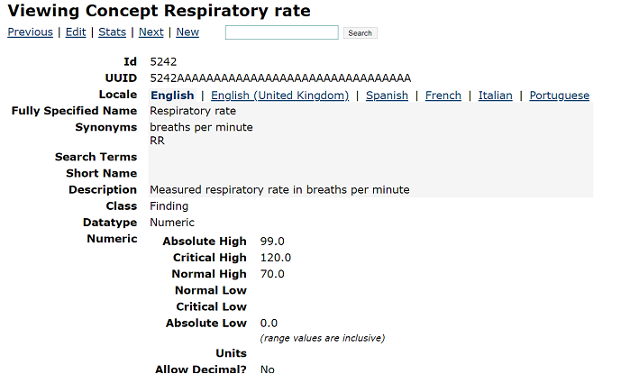

# Provenance Demonstration Use Case

Introduce the provenance features of OpenMRS through a scenario involving three actors (doctor, nurse and administrator) in a hospital where using OpenMRS as a medical record system. 
There will be situations when OpenMRS's concept dictionary returns the appropriate result (high blood pressure) and incorrect results (respiratory rate).

---

The doctor tells the system administrator that he wants the nurse to take extra care of patients with high blood pressure and abnormal respiratory rate. 
The system administrator first searches those two terms in the concept dictionary. The system returns medical terms for those two diagnoses.

The administrator searches online for symptoms of high blood pressure and abnormal respiratory rate.

> Examples links for symptoms: 
>- [High blood pressure](https://www.stroke.org.nz/blood-pressure)
>- [Respiratory rate](https://www.healthnavigator.org.nz/health-a-z/b/breathing-rate/#:~:text=hurts%20to%20breathe.-,Normal%20breathing%20rate,or%20your%20rate%20is%20abnormal)

The administrator decides the benchmarks for high blood pressure (systolic/diastolic >= 140/90) and abnormal respiratory rate (12 < breathing rate < 25).

The administrator uses the Patient Flags module in OpenMRS to get a list of patients with those symptoms and alert the nurse when she checks their records.

The administrator first creates a Priority for those signs. This step includes choosing the rank and colour of the flag. The administrator decides the signal has rank #1 and red for extra attention.

The administrator then creates a tag for the flag. The tag limits providers who can see the flag on the patient dashboard. The administrator decides the flag will only be visible to the doctor, nurse and system administrator.

The administrator finally creates a flag for those symptoms. Under the criteria section, he finds patients in OpenMRS who have the most recent vitals recorded that met the benchmarks above. He writes a message for the flag (which will appear on Patient Dashboard): "Need extra care!". Then, he selects Priority rank and the tag created earlier for the flag. After saving the flag, he can search for a list of patients who get flagged.

When checking a patient's record, a nurse sees the flag on the dashboard with the message above. However, she cannot find out why this patient received that flag.
